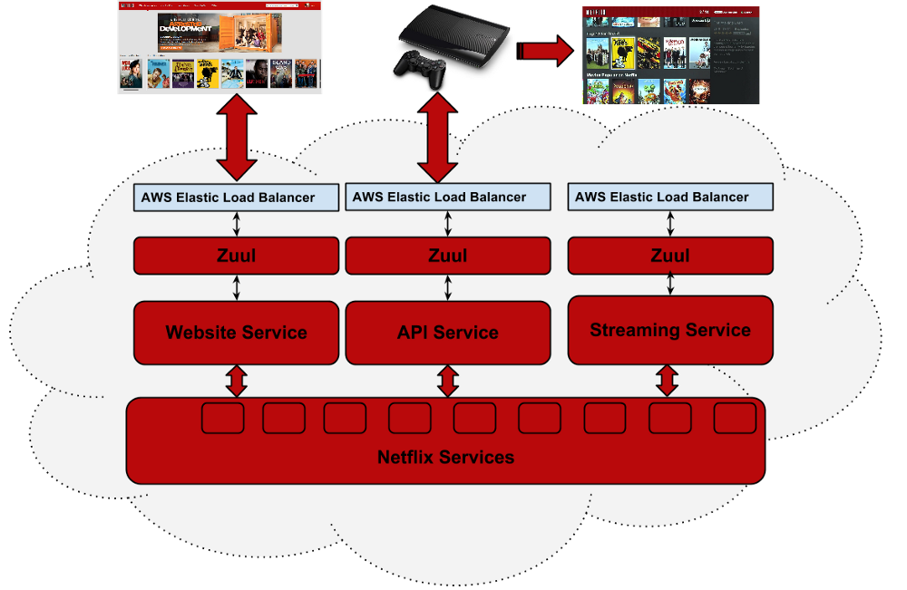

#### 2019 / Cloud Technology / Microservice Architecture

## MICROSERVICE ARCHITECTURE : NETFLIX ZUUL

### 1. API GATEWAY?

> Microservice Architecture(이하 MSA)를 구축하기 전에 사용할 컴포넌트들을 검색하고 알아본 결과 API GATEWAY는 MSA를 구현할 때 개보린 같은 역활을 해주는 착한 녀석이다.

- MSA에서 API GATEWAY란.

  > MSA에 대해 공부한다면서 왜 API GATEWAY를 말하고 앉아있을까 알고 들어가는게 좋지 않을까?

  

  그들(API GATEWAY)은 API 서버 앞단에서 모든 API 서버로 들어오는 클라이언트의 요청의 end point를 단일화로 통합하는 서버이며 (마치 프록시 서버처럼 동작을 한다.....), 이 기능만 하면 재미가 없어 API에 대한 인증과 권한부터 모니터링, 로깅, 메시지에 따라서 여러 서버로 라우팅까지 매우 고급진 기능을 담당하고 있다.

  

  

  *"아아.... 속 편해라.." : 내가 할일을 다 처리해주는 속시원한 API GATEWAY*

  

  여담으로 API GATEWAY는 ESB (Enterprise Service Bus)를 계승하였다. 마치 MSA가 SOA(Service Oriented Architecture | 서비스 지향 아키텍처)를 계승한 것 마냥 ESB의 실패사례를 분석해서 만들어진 기능 ESB가 SOAP/XML 웹기반 서비스를 지원하는 구조였지만, API GATEWAY는 최근에 많이 쓰이는 JSON/REST 기반으로 최소한의 기능을 처리하는 경량화 서비스!!  추가로 ESB는 SOA 사상에서 탄생한 솔루션이고 API GATEWAY는 MSA, REST 구현 사례를 통해서 탄생한 솔루션이기 때문에 API GATEWAY를 MSA 구현 시 사용하기로 한다.

  

- API GATEWAY FUNCTION LIST.

  > 그들을 사용하기 위해서 주요 기능 정도는 알아두는게 좋지 않을까?

  

  - 인증/권한/인가

    가장 기본적인 기능이지만 중요한 기능중 하나인 인증/권한/인가에 대한 기능이다. 그들의 인증은, API를 호출하는 클라이언트에 대한 권한을 확인 후, 권한이 있다면 클라이언트가 API를 호출 할 수 있게 도와주는 역활이다. 쉽게 생각하면, 당신이 페이스북 사용자가 맞는지, 사용자가 맞으면 게시물을 작성할 수 있는지 판단하는 역활을 하고 있다는 거다.

    

  - API 라우팅

    그들은 수 많은 클라이언트에서의 API 호출을 라우팅 하는 기능을 제공해준다. 같은 API 라도 사용하는 서비스나 클라이언트에 따라서 각기 다른 end point를 이용하여 서비스를 제공하거나(증말 귀찮게...), 클라우드 사업자 및 데이터 센터가 여러개 일 경우 데이터 센터간 라우팅을 지원하는 기능이다. 쉽게 말해서 클라이언트의 요청에 따라서 필요한 서비스 별로 라우팅을 지원해 준다는 말이다. 이렇게 말해도 감이 안오는 이유는 구현을 안해봐서 그런거다. 실습하면 이해된다.

    

  - 그 이외의 공통 로직 처리 기능들

    엄청 많아서 자세히 못쓰겠다. 크게 보자면 

    - 메세지 포맷 변환
    - 프로토콜 변환
    - 메세지 호출 패턴 변환
    - 여러개의 API를 묶어 하나의 API를 만드는 어그레게이션
    - 로깅 & 모니터링....

    겁나 많다. 나머지는 알아서 찾아보자.

### 2. Netflix Zuul : Cloud Edge Service!!!

> Netflix 그거 드라마랑 영화 보고 게임도 하고 하는 복합 엔터테이먼트 스트리밍 서비스 아닌가? 근데 왜 나오지? 라고 생각하는데 그들은 엄청난 기술력도 가지고 있다고! Netflix에서는 왜 Zuul이라는 놈을 만들었고, Zuul이 뭔지 한번 알아도 보고!
>

그들(Netflix)은 엄청난 엔터테인먼트 스트리밍 서비스 업체로 엄청난 문어발식 서비스를 보여주고 있는 업체이다.

*"아! 넷플릭스 아시는구나!" : 드라마, 영화, 다큐멘터리, 오리지널 시리즈까지 다양한 컨텐츠를 제공하는 회사.*

그들은 자신들이 만든 오픈소스 프로젝트인 Zuul을 가지고 Cloud에 어찌 적용했나 아키텍처를 확인해볼까 하고 찾아봤다.

*"이게 뭐람... 그만 알아보자" : 그들은 Zuul을 AWS LB를 통해 들어오는 클라이언트의 요청을 각 서비스로 연결하는 중간자 API GATEWAY 역활로 정직하게 사용하고 있으며, 각 서비스는 통합 Netflix Services를 호출하는 역활을 하고 있다.*

현재의 Netflix의 Zuul은 오픈소스로 다양한 개발자가 언제든 가져다 쓸 수 있는 API GATEWAY이며, 직접 구축하는 거 보다 쉽게 가져다가 사용할 수 있다.

- Zuul : 그들은 무엇이며, 무엇인가?

  > 일딴 Netflix에서 만든 Zuul은 API GATEWAY로 Netflix에서도 자신들이 사용하기 위한 오픈소스인것을 알겠다.    그럼 정확하게 무슨 역활을 하고 있으며, 어떤 동작 원리를 가지고 있는가 알아야 뭔가 뚝딱거려보겠지???
  >
  > 그걸 지금 알아보자꾸나 후후...

  일딴 그들(Zuul)은 Netflix에서 자신(Netflix)들이 사용하기 위한 API GATEWAY인 것을 알아냈다.  (알아냈다기 보다 그들이 아키텍처 그림을통해서 가르쳐줬지...) 그럼 이게 뭔지는 알았으니깐, 무슨역할을 하고 있는지를 확인해보자. 아마 API GATEWAY라니깐 그 역활을 하고 있겠지만 뭔가 더 특이하고 간편한 기능을 제공해 주지 않을까 라는 기대를 가지고 말이다.

  

  

  *"역시 형이야 쉽게 구현할 수 있구나! 아니 씨X.... " : 그렇다. Zuul은 편의적 기능이 추가됬지만 또 어려워졌다. 뭔 소용인가 젠장, 편리하려고 쓰는걸 또 공부해서 사용해야하는 이 딜레마....*

   

  그들은 JVM 기반의 API GATWAY로 기본 API GATEWAY가 제공하는 라우팅, 인증, 등등.... 기본 제공을 지원하고 있으며, 우리가 희망한 것 처럼 그들만의 대단한(?) 추가 기능이 있다.  (사실 기능이라고 하기도 애매모호하다.)  그것도 알아보고 우리가 좋아하는 Getting Start를 이제 한번쯤 해볼 때가 된거 같다. 세상의 이치로 100번 글을 읽어보는것 보다 1번 해보는게 정말 이해가 잘 될꺼 같은데 연애는 그렇지 않다. 여튼, Getting Start를 해보기로 하면서 다음 페이지로 넘어가 보겠다.  (절대 귀찮아서 여기에서 쉬려고 하는거 아니다. 정말이다. 아마도...)

*"후후.. 이거 한번 해보고 싶었어"*

## [# 다음장에 계속](./README2.md).