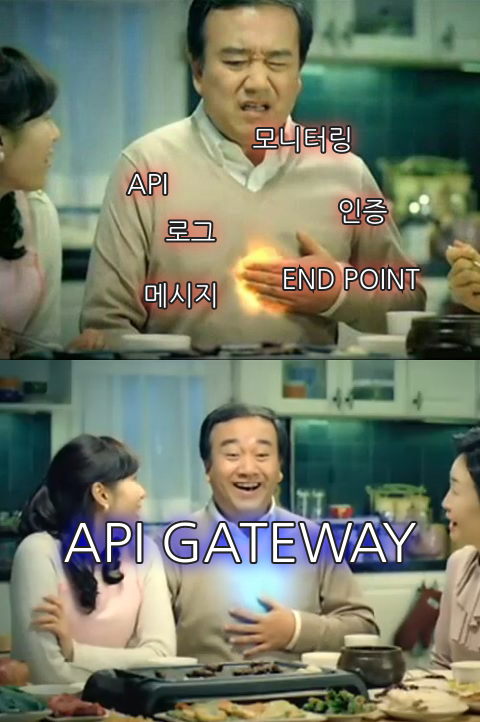

#### 2019 / Cloud Technology / Microservice Architecture

## MICROSERVICE ARCHITECTURE : NETFLIX ZUUL

### 1. API GATEWAY?

> Microservice Architecture(이하 MSA)를 구축하기 전에 사용할 컴포넌트들을 검색하고 알아본 결과 API GATEWAY는 MSA를 구현할 때 개보린 같은 역활을 해주는 착한 녀석이다.

- MSA에서 API GATEWAY란.

  > MSA에 대해 공부한다면서 왜 API GATEWAY를 말하고 앉아있을까 알고 들어가는게 좋지 않을까?

  

  그들(API GATEWAY)은 API 서버 앞단에서 모든 API 서버로 들어오는 클라이언트의 요청의 end point를 단일화로 통합하는 서버이며 (마치 프록시 서버처럼 동작을 한다.....), 이 기능만 하면 재미가 없어 API에 대한 인증과 권한부터 모니터링, 로깅, 메시지에 따라서 여러 서버로 라우팅까지 매우 고급진 기능을 담당하고 있다.

  

  

  *"아아.... 속 편해라.." : 내가 할일을 다 처리해주는 속시원한 API GATEWAY*

  

  여담으로 API GATEWAY는 ESB (Enterprise Service Bus)를 계승하였다. 마치 MSA가 SOA(Service Oriented Architecture | 서비스 지향 아키텍처)를 계승한 것 마냥 ESB의 실패사례를 분석해서 만들어진 기능

  ESB가 SOAP/XML 웹기반 서비스를 지원하는 구조였지만, API GATEWAY는 최근에 많이 쓰이는 JSON/REST 기반으로 최소한의 기능을 처리하는 경량화 서비스!! 

  추가로 ESB는 SOA 사상에서 탄생한 솔루션이고 API GATEWAY는 MSA, REST 구현 사례를 통해서 탄생한 솔루션이기 때문에 API GATEWAY를 MSA 구현 시 사용하기로 한다.

  

- API GATEWAY FUNCTION LIST.

  > 그들을 사용하기 위해서 주요 기능 정도는 알아두는게 좋지 않을까?

  

  - 인증/권한/인가

    가장 기본적인 기능이지만 중요한 기능중 하나인 인증/권한/인가에 대한 기능이다. 그들의 인증은, API를 호출하는 클라이언트에 대한 권한을 확인 후, 권한이 있다면 클라이언트가 API를 호출 할 수 있게 도와주는 역활이다.

    쉽게 생각하면, 당신이 페이스북 사용자가 맞는지, 사용자가 맞으면 게시물을 작성할 수 있는지 판단하는 역활을 하고 있다는 거다.

    

  - API 라우팅

    그들은 수 많은 클라이언트에서의 API 호출을 라우팅 하는 기능을 제공해준다. 같은 API 라도 사용하는 서비스나 클라이언트에 따라서 각기 다른 end point를 이용하여 서비스를 제공하거나(증말 귀찮게...), 클라우드 사업자 및 데이터 센터가 여러개 일 경우 데이터 센터간 라우팅을 지원하는 기능이다.

    쉽게 말해서 클라이언트의 요청에 따라서 필요한 서비스 별로 라우팅을 지원해 준다는 말이다. 이렇게 말해도 감이 안오는 이유는 구현을 안해봐서 그런거다. 실습하면 이해된다.

    

  - 그 이외의 공통 로직 처리 기능들

    엄청 많아서 자세히 못쓰겠다. 크게 보자면 

    - 메세지 포맷 변환
    - 프로토콜 변환
    - 메세지 호출 패턴 변환
    - 여러개의 API를 묶어 하나의 API를 만드는 어그레게이션
    - 로깅 & 모니터링....

    겁나 많다. 나머지는 알아서 찾아보자.

### 2. Netflix Zuul : Cloud Edge Service!!!

> Netflix 그거 드라마랑 영화 보고 게임도 하고 하는 복합 엔터테이먼트 스트리밍 서비스 아닌가? 근데 왜 나오지? 라고 생각하는데 그들은 엄청난 기술력도 가지고 있다고!
>
> Netflix에서는 왜 Zuul이라는 놈을 만들었고, Zuul이 뭔지 한번 알아도 보고!

그들(Netflix)은 엄청난 엔터테인먼트 스트리밍 서비스 업체로 엄청난 문어발식 서비스를 보여주고 있는 업체이다.

*"아! 넷플릭스 아시는구나!" : 드라마, 영화, 다큐멘터리, 오리지널 시리즈까지 다양한 컨텐츠를 제공하는 회사.*

