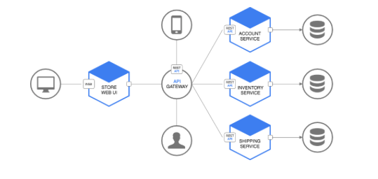

#### 2019 / Cloud Technology / Microservice Architecture

## GETTING START!!!<br/> MICROSERVICE ARCHITECTURE : NETFLIX ZUUL


### 1. Netflix Zuul Features

> 개발 문서 및 개발에 관련한 서적을 보면 Features로 시작하니깐 나도 그렇게 시작해 보겠다.

- Netflix Zuul 동작 방식

  

  그들의 동작 방식은 생각보다 단순한다.

  

  FRONT-END ><br/>*Routing rules : shard traffic with path* ><br/>*Zuul* ><br/>*Service discovery : instance lookup* ><br/>BACK-END REST API

   

  단지 중간에 Zuul의 역할이 들어가는 무언 복잡미묘시러운 기능이 3개가 추가 된 것을 확인 할 수 있지만, 저것만 없으면 일반 WAS REST API 통신 방법하고 다를바가 없는 평범한 동작방식이다. (여기까진 이렇게만 생각하고 싶을 수도 있다.)<br/>자 이제 직접 구현할 시기가 왔기 때문에 하나 하나 기능별로 구분해 가면서 개발 가이드를 작성해 본다.

  

- Routing Rules 작성

  앞서 그들의 동작 방식에서 FRONT-END에서 Routing Rules 를 정의한다고 되어 있다. <br/>(영어로 대충 써놨지만 대충 그런 내용이다.)

  정확하게 말하자면, **_FRONT-END로 들어온 request를 prefix or path에 따라  특정 서비스로 라우팅 하기 위한 규칙을 적는다고 하는데,_** 결국에는 클라이언트에서 들어온 요청을 사용자가 지정한 Rule에 맞춰 서비스로 라우팅 해주는다는 뜻이다.

  자, 그럼 그 규칙을 정의하는 방법을 보자.

  

  ```properties
  zuul:
  routes:
    users:
      path: /myusers/**
      url: http://example.com/user_service
  ```

  위 방법이 Zuul Routing Rules 의 예시 중 하나이다.<br/>정말 간단하게 작성할 수 있으며, 한눈에 들어오는 그들만의 Rules 작성법이다. (여기까진 간단한거 같다.)

   

  위 규칙 작성 방법만 보면 우리는 정말 Zuul를 쉽게 배울 수 있을 꺼 같다.<br/>

  *"하지만 언제나 조져지는 건 나였다" : 아직까진 괜찮겠지만 앞으로는 어찌될 지 모르겠다.. 나름 쉽게 작성했고, 쉽게 만들어진 오픈소스이니 희망을 놓지 말자.*

